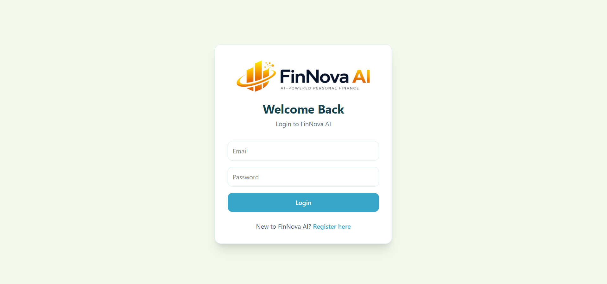
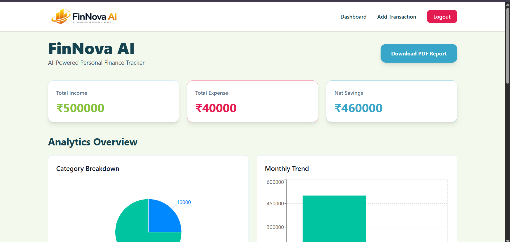
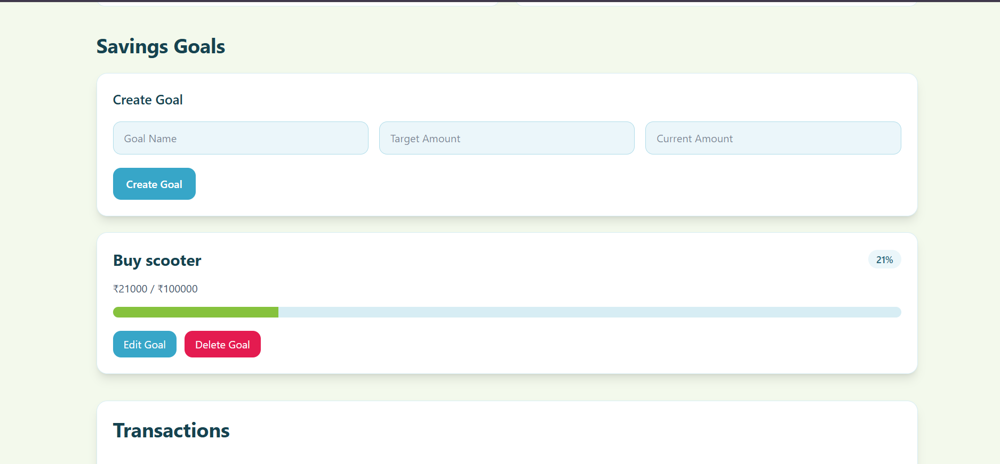

# 🚀 FinNova AI – AI Powered Personal Finance Tracker


---

# 📌 Overview

FinNova AI is a full-stack AI-powered personal finance management platform that helps users track income, expenses, savings goals, and receive intelligent financial recommendations generated using Google Gemini AI.

The application provides secure authentication, real-time financial analytics, interactive visualizations, savings goal tracking, PDF report generation, and personalized AI-driven financial insights.

Built as a production-style fintech project for software engineering placements and portfolio showcasing.

---

# 🌐 Live Demo

### Frontend

https://finnova-ai-finance.vercel.app/

### Backend

https://finnova-backend-5j4m.onrender.com

---

# ✨ Features

## 🔐 Authentication & Security

- User Registration
- User Login
- JWT Authentication
- Password Encryption using BCrypt
- Protected Routes
- Secure API Access

---

## 💰 Transaction Management

Users can:

- Add Income
- Add Expenses
- Edit Transactions
- Delete Transactions
- View Transaction History

---

## 📊 Financial Analytics Dashboard

Automatically calculates:

- Total Income
- Total Expenses
- Net Savings

### Category Breakdown

Visualized using Pie Charts.

Tracks:

- Food
- Travel
- Rent
- Shopping
- Utilities
- Other Categories

### Monthly Trend Analysis

Visualized using Bar Charts.

Tracks:

- Monthly Income
- Monthly Expenses
- Spending Trends

---

## 🎯 Savings Goal Management

Users can:

- Create Goals
- Track Goal Progress
- Edit Goals
- Delete Goals

Example:

- Goal: Buy Scooter
- Target Amount: ₹100000
- Current Amount: ₹21000
- Progress: 21%

---

## 🤖 AI Financial Advisor

Powered by Google Gemini AI.

Generates personalized financial insights based on:

- Income
- Expenses
- Savings
- Spending Categories
- Savings Goals

Provides:

- Spending Analysis
- Savings Analysis
- Financial Health Score
- Goal Achievement Estimates
- Personalized Recommendations

---

## 📄 PDF Report Generation

Generate downloadable reports containing:

- Income Summary
- Expense Summary
- Savings Information
- Financial Analytics

---

# 🏗️ System Architecture

```text
User
  │
  ▼
React + Vite Frontend (Vercel)
  │
  │ HTTPS + JWT
  ▼
Spring Boot Backend (Render)
  │
  ├── Authentication Module
  ├── Transaction Module
  ├── Analytics Module
  ├── Savings Goal Module
  ├── AI Insights Module
  │
  ▼
Neon PostgreSQL
  │
  ▼
Gemini 2.5 Flash API
```

---

# 🛠️ Tech Stack

## Frontend

- React
- Vite
- Tailwind CSS
- Axios
- React Router DOM
- Recharts

## Backend

- Java 17
- Spring Boot
- Spring Security
- Spring Data JPA
- JWT Authentication
- Maven

## Database

- PostgreSQL
- Neon Cloud Database

## AI Integration

- Google Gemini 2.5 Flash

## Deployment

### Frontend

- Vercel

### Backend

- Render

### Database

- Neon PostgreSQL

---

# 📂 Project Structure

```text
src/main/java/com/atharva/finance_tracker

├── controller
├── service
├── repository
├── entity
├── dto
├── security
├── config
└── FinanceTrackerApplication
```

---

# 🔑 REST API Endpoints

## Authentication

### Register User

```http
POST /api/auth/register
```

### Login User

```http
POST /api/auth/login
```

Returns JWT Token.

---

## Transactions

### Create Transaction

```http
POST /api/transactions
```

### Get Transactions

```http
GET /api/transactions
```

### Update Transaction

```http
PUT /api/transactions/{id}
```

### Delete Transaction

```http
DELETE /api/transactions/{id}
```

---

## Analytics

### Financial Summary

```http
GET /api/analytics/summary
```

### Category Breakdown

```http
GET /api/analytics/categories
```

### Monthly Trends

```http
GET /api/analytics/monthly-trend
```

---

## Savings Goals

### Create Goal

```http
POST /api/goals
```

### Get Goals

```http
GET /api/goals
```

### Update Goal

```http
PUT /api/goals/{id}
```

### Delete Goal

```http
DELETE /api/goals/{id}
```

---

## AI Insights

### Generate Insights

```http
POST /api/ai/insights
```

Returns:

- Financial Health Score
- Savings Analysis
- Spending Analysis
- Recommendations

---

# 🗄️ Database Schema

## Users Table

| Column | Type |
|----------|----------|
| id | BIGINT |
| name | VARCHAR |
| email | VARCHAR |
| password | VARCHAR |
| created_at | TIMESTAMP |

---

## Transactions Table

| Column | Type |
|----------|----------|
| id | BIGINT |
| user_id | BIGINT |
| amount | DOUBLE |
| category | VARCHAR |
| type | VARCHAR |
| description | VARCHAR |
| transaction_date | DATE |

---

## Goals Table

| Column | Type |
|----------|----------|
| id | BIGINT |
| user_id | BIGINT |
| goal_name | VARCHAR |
| target_amount | DOUBLE |
| current_amount | DOUBLE |

---

# 📸 Application Screenshots

## Register Page


## Login Page



## Dashboard



## Analytics


## Savings Goals



## Transactions


## AI Financial Advisor


## Add Transaction


---

# ⚙️ Environment Variables

Create an `application.properties` file:

```properties
spring.datasource.url=
spring.datasource.username=
spring.datasource.password=

jwt.secret=

gemini.api.key=
```

---

# 🚀 Run Locally

## Clone Repository

```bash
git clone https://github.com/SyntaxNova/FinNova-AI-Powered-Personal-Finance.git
```

## Navigate

```bash
cd FinNova-AI-Powered-Personal-Finance
```

## Install Dependencies

```bash
./mvnw clean install
```

## Start Application

```bash
./mvnw spring-boot:run
```

Application starts on:

```text
http://localhost:8080
```

---

# 📈 Future Improvements

- Budget Tracking System
- Expense Forecasting
- Investment Recommendations
- Multi-Currency Support
- Email Reports
- Mobile Application
- OCR Receipt Scanning
- Recurring Transaction Detection

---

# 👨‍💻 Developer

### Atharva Pachpute

Software Engineer

GitHub:
https://github.com/SyntaxNova

LinkedIn:
https://www.linkedin.com/in/atharva-pachpute3/

---
